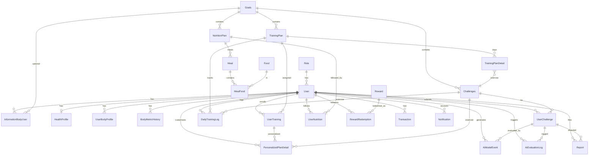

# Báo cáo Entity (JPA) — Fit Challenge Java Backend

Tài liệu mô tả **các entity JPA** trong `Fit_Ai_Challenge_Web-App_BE`, package `com.example.fitchallenge.Entity`.

## Tổng quan

- **Tổng số entities**: **26** class `@Entity`
- **Công nghệ**: Hibernate/JPA + PostgreSQL
- **Package**: `com.example.fitchallenge.Entity`

---

## 1) Tổng quan theo nhóm nghiệp vụ

| Nhóm | Entity | Bảng DB | Ý nghĩa ngắn gọn |
|------|--------|---------|------------------|
| **Danh tính & phân quyền** | `Role` | `Role_user` | Vai trò người dùng |
| | `User` | `User` | Tài khoản: email, mật khẩu, điểm, avatar, liên kết role |
| **Mục tiêu & thử thách** | `Goals` | `Goals` | Mục tiêu tập luyện (catalog) |
| | `Challenges` | `Challenges` | Thử thách thuộc một goal (độ khó, video, loại bài AI, **min_reps / max_reps** ngưỡng pass cho AI) |
| | `UserChallenge` | `user_challenges` | User tham gia challenge: video, điểm, payload AI |
| **Kế hoạch tập** | `TrainingPlan` | `training_plans` | Kế hoạch theo tuần, thuộc một goal |
| | `TrainingPlanDetail` | `training_plan_details` | Từng ngày trong plan: gắn challenge, sets/reps… |
| | `UserTraining` | `user_training` | User đang theo plan nào, tiến độ ngày |
| | `PersonalizedPlanDetail` | `personalized_plan_detail` | Bài tập đã cá nhân hóa (theo user + day + challenge) |
| | `DailyTrainingLog` | `daily_training_logs` | Nhật ký tập theo ngày: trạng thái, calo, score AI… |
| **Hồ sơ sức khỏe / cơ thể** | `HealthProfile` | `health_profile` | Hồ sơ sức khỏe chi tiết (1–1 với user) |
| | `UserBodyProfile` | `user_body_profile` | Chỉ số cơ thể phục vụ cá nhân hóa bài tập |
| | `BodyMetricHistory` | `body_metric_history` | Lịch sử cân nặng, BMI, body fat… |
| | `InformationBodyUser` | `information_body_user` | Thông tin cơ thể + optional link tới goal |
| **Dinh dưỡng** | `NutritionPlan` | `nutrition_plans` | Kế hoạch ăn theo goal |
| | `Meal` | `meals` | Bữa ăn trong plan |
| | `Food` | `foods` | Thực phẩm (macro trên 100g) |
| | `MealFood` | `meal_foods` | Nhiều–nhiều Meal ↔ Food (khối lượng g) |
| | `UserNutrition` | `user_nutrition` | User đang theo nutrition plan nào |
| **Điểm thưởng & giao dịch** | `Reward` | `rewards` | Phần thưởng đổi bằng điểm |
| | `RewardRedemption` | `reward_redemptions` | Lịch sử đổi quà |
| | `Transaction` | `transactions` | Giao dịch điểm/tiền (type, points, amount) |
| **AI & hỗ trợ** | `AiEvaluationLog` | `ai_evaluation_logs` | Log pipeline đánh giá AI (input/output JSON, score) |
| | `AiModelEvent` | `ai_model_events` | Kết quả model gắn `UserChallenge`; cột **reps**, **quality_score**, **confidence**, **passed** + FK **user_id** để query nhanh (index `user_id, created_at`); `result_json` giữ blob đầy đủ |
| | `Report` | `reports` | Khiếu nại / báo cáo sai sót AI hoặc hệ thống |
| | `Notification` | `notifications` | Thông báo in-app cho user |

---

## 2) Chi tiết từng Entity

### 2.1 Danh tính & phân quyền

#### `Role`
```java
@Entity
@Table(name = "Role_user")
public class Role {
    @Id
    @GeneratedValue(strategy = GenerationType.IDENTITY)
    private Long Role_id;
    
    private String role_name;  // ADMIN, USER, COACH
}
```

#### `User`
```java
@Entity
@Table(name = "User")
public class User {
    @Id
    @GeneratedValue(strategy = GenerationType.IDENTITY)
    private Long User_Id;
    
    private String email;
    private String password;
    private Integer points;
    private String avatar;
    
    @ManyToOne
    @JoinColumn(name = "Role_id")
    private Role role;
    
    // One-to-Many relations
    @OneToMany(mappedBy = "user")
    private List<InformationBodyUser> bodyInfos;
}
```

---

### 2.2 Mục tiêu & thử thách

#### `Goals`
```java
@Entity
@Table(name = "Goals")
public class Goals {
    @Id
    @GeneratedValue(strategy = GenerationType.IDENTITY)
    private Long goal_id;
    
    private String goal_name;        // WEIGHT_LOSS, MUSCLE_GAIN, ENDURANCE
    private String description;
    private String difficulty_level; // BEGINNER, INTERMEDIATE, ADVANCED
    
    @OneToMany(mappedBy = "goal")
    private List<Challenges> challenges;
    
    @OneToMany(mappedBy = "goal")
    private List<TrainingPlan> trainingPlans;
    
    @OneToMany(mappedBy = "goal")
    private List<NutritionPlan> nutritionPlans;
}
```

#### `Challenges`
```java
@Entity
@Table(name = "Challenges")
public class Challenges {
    @Id
    @GeneratedValue(strategy = GenerationType.IDENTITY)
    private Long challenge_id;
    
    private String challenge_name;
    private String description;
    private String video_url;
    private String ai_exercise_type;  // PUSHUP, SQUAT, PLANK, etc.
    
    // AI pass thresholds
    private Integer min_reps;
    private Integer max_reps;
    private Integer difficulty_score;
    
    @ManyToOne
    @JoinColumn(name = "goal_id")
    private Goals goal;
    
    @OneToMany(mappedBy = "challenge")
    private List<UserChallenge> userChallenges;
    
    @OneToMany(mappedBy = "challenge")
    private List<TrainingPlanDetail> planDetails;
}
```

#### `UserChallenge`
```java
@Entity
@Table(name = "user_challenges")
public class UserChallenge {
    @Id
    @GeneratedValue(strategy = GenerationType.IDENTITY)
    private Long uc_id;
    
    private String video_url;
    private Integer score;
    private String ai_payload;  // JSON data for AI processing
    private LocalDateTime submitted_at;
    
    @ManyToOne
    @JoinColumn(name = "user_id")
    private User user;
    
    @ManyToOne
    @JoinColumn(name = "challenge_id")
    private Challenges challenge;
    
    @OneToMany(mappedBy = "userChallenge")
    private List<AiModelEvent> aiEvents;
}
```

---

### 2.3 Kế hoạch tập

#### `TrainingPlan`
```java
@Entity
@Table(name = "training_plans")
public class TrainingPlan {
    @Id
    @GeneratedValue(strategy = GenerationType.IDENTITY)
    private Long tp_id;
    
    private String plan_name;
    private Integer duration_weeks;
    private String description;
    
    @ManyToOne
    @JoinColumn(name = "goal_id")
    private Goals goal;
    
    @OneToMany(mappedBy = "trainingPlan")
    private List<TrainingPlanDetail> details;
    
    @OneToMany(mappedBy = "trainingPlan")
    private List<UserTraining> userTrainings;
}
```

#### `TrainingPlanDetail`
```java
@Entity
@Table(name = "training_plan_details")
public class TrainingPlanDetail {
    @Id
    @GeneratedValue(strategy = GenerationType.IDENTITY)
    private Long tpd_id;
    
    private Integer day_number;      // Day 1, Day 2, etc.
    private Integer sets;
    private Integer reps;
    private Integer rest_seconds;
    private String notes;
    
    @ManyToOne
    @JoinColumn(name = "tp_id")
    private TrainingPlan trainingPlan;
    
    @ManyToOne
    @JoinColumn(name = "challenge_id")
    private Challenges challenge;
}
```

#### `UserTraining`
```java
@Entity
@Table(name = "user_training")
public class UserTraining {
    @Id
    @GeneratedValue(strategy = GenerationType.IDENTITY)
    private Long ut_id;
    
    private Integer current_day;     // Progress tracking
    private LocalDate start_date;
    private String status;           // ACTIVE, COMPLETED, PAUSED
    
    @ManyToOne
    @JoinColumn(name = "user_id")
    private User user;
    
    @ManyToOne
    @JoinColumn(name = "tp_id")
    private TrainingPlan trainingPlan;
    
    @OneToMany(mappedBy = "userTraining")
    private List<PersonalizedPlanDetail> personalizedDetails;
}
```

#### `PersonalizedPlanDetail`
```java
@Entity
@Table(name = "personalized_plan_detail")
public class PersonalizedPlanDetail {
    @Id
    @GeneratedValue(strategy = GenerationType.IDENTITY)
    private Long ppd_id;
    
    private Integer day_number;
    private Integer customized_sets;
    private Integer customized_reps;
    private String notes;
    
    // Reference IDs (not full JPA relations)
    private Long tpd_id;  // Template detail ID
    private Long ut_id;   // User training ID
    
    @ManyToOne
    @JoinColumn(name = "user_id")
    private User user;
    
    @ManyToOne
    @JoinColumn(name = "challenge_id")
    private Challenges challenge;
}
```

#### `DailyTrainingLog`
```java
@Entity
@Table(name = "daily_training_logs")
public class DailyTrainingLog {
    @Id
    @GeneratedValue(strategy = GenerationType.IDENTITY)
    private Long dtl_id;
    
    private LocalDate training_date;
    private String status;           // COMPLETED, SKIPPED, PARTIAL
    private Integer calories_burned;
    private Integer ai_score;
    private Integer total_reps;
    private String notes;
    
    @ManyToOne
    @JoinColumn(name = "user_id")
    private User user;
    
    @ManyToOne
    @JoinColumn(name = "tp_id")
    private TrainingPlan trainingPlan;
    
    @ManyToOne
    @JoinColumn(name = "challenge_id")
    private Challenges challenge;
}
```

---

### 2.4 Hồ sơ sức khỏe / cơ thể

#### `HealthProfile`
```java
@Entity
@Table(name = "health_profile")
public class HealthProfile {
    @Id
    @GeneratedValue(strategy = GenerationType.IDENTITY)
    private Long id;
    
    // One-to-One with User
    @OneToOne
    @JoinColumn(name = "user_id", unique = true)
    private User user;
    
    private String medical_conditions;
    private String allergies;
    private String fitness_experience;
    private String injuries;
    private Double bmr;              // Basal Metabolic Rate
    private Double tdee;             // Total Daily Energy Expenditure
}
```

#### `UserBodyProfile`
```java
@Entity
@Table(name = "user_body_profile")
public class UserBodyProfile {
    @Id
    @GeneratedValue(strategy = GenerationType.IDENTITY)
    private Long id;
    
    @ManyToOne
    @JoinColumn(name = "user_id")
    private User user;
    
    private Double weight;
    private Double height;
    private Integer age;
    private String gender;
    private Double body_fat_percentage;
    private String activity_level;
    private String fitness_goal;
}
```

#### `BodyMetricHistory`
```java
@Entity
@Table(name = "body_metric_history")
public class BodyMetricHistory {
    @Id
    @GeneratedValue(strategy = GenerationType.IDENTITY)
    private Long bmh_id;
    
    @ManyToOne
    @JoinColumn(name = "user_id")
    private User user;
    
    private LocalDate recorded_date;
    private Double weight;
    private Double bmi;
    private Double body_fat_percentage;
    private Double muscle_mass;
}
```

#### `InformationBodyUser`
```java
@Entity
@Table(name = "information_body_user")
public class InformationBodyUser {
    @Id
    @GeneratedValue(strategy = GenerationType.IDENTITY)
    private Long info_id;
    
    @ManyToOne
    @JoinColumn(name = "user_id")
    private User user;
    
    @ManyToOne
    @JoinColumn(name = "goal_id", nullable = true)
    private Goals goal;
    
    private Double weight;
    private Double height;
    private Integer age;
    private String gender;
    private String activity_level;
}
```

---

### 2.5 Dinh dưỡng

#### `NutritionPlan`
```java
@Entity
@Table(name = "nutrition_plans")
public class NutritionPlan {
    @Id
    @GeneratedValue(strategy = GenerationType.IDENTITY)
    private Long plan_id;
    
    private String plan_name;
    private String description;
    private Integer duration_days;
    private Double daily_calories;
    private Double daily_protein;
    private Double daily_carbs;
    private Double daily_fat;
    
    @ManyToOne
    @JoinColumn(name = "goal_id")
    private Goals goal;
    
    @OneToMany(mappedBy = "nutritionPlan")
    private List<Meal> meals;
    
    @OneToMany(mappedBy = "nutritionPlan")
    private List<UserNutrition> userNutritions;
}
```

#### `Meal`
```java
@Entity
@Table(name = "meals")
public class Meal {
    @Id
    @GeneratedValue(strategy = GenerationType.IDENTITY)
    private Long meal_id;
    
    private String meal_type;        // BREAKFAST, LUNCH, DINNER, SNACK
    private Integer day_number;
    private String description;
    
    @ManyToOne
    @JoinColumn(name = "plan_id")
    private NutritionPlan nutritionPlan;
    
    @OneToMany(mappedBy = "meal")
    private List<MealFood> mealFoods;
}
```

#### `Food`
```java
@Entity
@Table(name = "foods")
public class Food {
    @Id
    @GeneratedValue(strategy = GenerationType.IDENTITY)
    private Long food_id;
    
    private String food_name;
    private String category;         // PROTEIN, CARB, VEGETABLE, FRUIT, FAT
    private Double calories_per_100g;
    private Double protein_per_100g;
    private Double carbs_per_100g;
    private Double fat_per_100g;
    private Integer estimated_cost_vnd;
    
    @OneToMany(mappedBy = "food")
    private List<MealFood> mealFoods;
}
```

#### `MealFood`
```java
@Entity
@Table(name = "meal_foods")
public class MealFood {
    @Id
    @GeneratedValue(strategy = GenerationType.IDENTITY)
    private Long mfId;
    
    private Double quantity_grams;
    private Double calculated_calories;
    private Double calculated_protein;
    
    @ManyToOne
    @JoinColumn(name = "meal_id")
    private Meal meal;
    
    @ManyToOne
    @JoinColumn(name = "food_id")
    private Food food;
}
```

#### `UserNutrition`
```java
@Entity
@Table(name = "user_nutrition")
public class UserNutrition {
    @Id
    @GeneratedValue(strategy = GenerationType.IDENTITY)
    private Long un_id;
    
    private LocalDate start_date;
    private String status;           // ACTIVE, COMPLETED, CANCELLED
    
    @ManyToOne
    @JoinColumn(name = "user_id")
    private User user;
    
    @ManyToOne
    @JoinColumn(name = "plan_id")
    private NutritionPlan nutritionPlan;
}
```

---

### 2.6 Điểm thưởng & giao dịch

#### `Reward`
```java
@Entity
@Table(name = "rewards")
public class Reward {
    @Id
    @GeneratedValue(strategy = GenerationType.IDENTITY)
    private Long reward_id;
    
    private String reward_name;
    private String description;
    private Integer points_required;
    private Integer quantity_available;
    private String image_url;
    private Boolean is_active;
}
```

#### `RewardRedemption`
```java
@Entity
@Table(name = "reward_redemptions")
public class RewardRedemption {
    @Id
    @GeneratedValue(strategy = GenerationType.IDENTITY)
    private Long rr_id;
    
    private LocalDateTime redeemed_at;
    private String status;           // PENDING, COMPLETED, CANCELLED
    private String delivery_address;
    
    @ManyToOne
    @JoinColumn(name = "user_id")
    private User user;
    
    @ManyToOne
    @JoinColumn(name = "reward_id")
    private Reward reward;
}
```

#### `Transaction`
```java
@Entity
@Table(name = "transactions")
public class Transaction {
    @Id
    @GeneratedValue(strategy = GenerationType.IDENTITY)
    private Long tx_id;
    
    private String transaction_type;   // EARN, REDEEM, PURCHASE, REFUND
    private Integer points_amount;
    private BigDecimal money_amount;
    private String description;
    private LocalDateTime created_at;
    
    @ManyToOne
    @JoinColumn(name = "user_id")
    private User user;
}
```

---

### 2.7 AI & hỗ trợ

#### `AiEvaluationLog`
```java
@Entity
@Table(name = "ai_evaluation_logs")
public class AiEvaluationLog {
    @Id
    @GeneratedValue(strategy = GenerationType.IDENTITY)
    private Long ael_id;
    
    private String input_json;         // AI input data
    private String output_json;        // AI output data
    private Integer ai_score;
    private Long processing_time_ms;
    private LocalDateTime created_at;
    
    @ManyToOne
    @JoinColumn(name = "user_id")
    private User user;
    
    @ManyToOne
    @JoinColumn(name = "challenge_id")
    private Challenges challenge;
    
    @ManyToOne
    @JoinColumn(name = "user_challenge_id", nullable = true)
    private UserChallenge userChallenge;
}
```

#### `AiModelEvent`
```java
@Entity
@Table(name = "ai_model_events")
@Index(name = "idx_user_created", columnList = "user_id, created_at")
public class AiModelEvent {
    @Id
    @GeneratedValue(strategy = GenerationType.IDENTITY)
    private Long event_id;
    
    // AI results
    private Integer reps;
    private Double quality_score;
    private Double confidence;
    private Boolean passed;
    private String exercise_type;
    
    // Model metadata
    private String model_name;
    private String model_version;
    private String model_provider;     // MEDIAPIPE, GEMINI, etc.
    
    // Full result blob
    @Column(columnDefinition = "TEXT")
    private String result_json;
    
    private LocalDateTime created_at;
    
    @ManyToOne
    @JoinColumn(name = "uc_id")
    private UserChallenge userChallenge;
    
    @ManyToOne
    @JoinColumn(name = "user_id")
    private User user;
    
    @ManyToOne
    @JoinColumn(name = "challenge_id", nullable = true)
    private Challenges challenge;
}
```

#### `Report`
```java
@Entity
@Table(name = "reports")
public class Report {
    @Id
    @GeneratedValue(strategy = GenerationType.IDENTITY)
    private Long report_id;
    
    private String report_type;        // AI_DISPUTE, BUG, FEATURE_REQUEST
    private String description;
    private String status;             // OPEN, IN_PROGRESS, RESOLVED, CLOSED
    private LocalDateTime created_at;
    private LocalDateTime resolved_at;
    
    @ManyToOne
    @JoinColumn(name = "user_id")
    private User user;
    
    @ManyToOne
    @JoinColumn(name = "challenge_id", nullable = true)
    private Challenges challenge;
    
    @ManyToOne
    @JoinColumn(name = "user_challenge_id", nullable = true)
    private UserChallenge userChallenge;
    
    @ManyToOne
    @JoinColumn(name = "ai_evaluation_log_id", nullable = true)
    private AiEvaluationLog aiEvaluationLog;
    
    @ManyToOne
    @JoinColumn(name = "assigned_to_user_id", nullable = true)
    private User assignedTo;
}
```

#### `Notification`
```java
@Entity
@Table(name = "notifications")
public class Notification {
    @Id
    @GeneratedValue(strategy = GenerationType.IDENTITY)
    private Long notification_id;
    
    private String title;
    private String message;
    private String notification_type;  // CHALLENGE_COMPLETE, PLAN_REMINDER, REWARD
    private Boolean is_read;
    private LocalDateTime created_at;
    private String action_url;         // Deep link
    
    @ManyToOne
    @JoinColumn(name = "user_id")
    private User user;
}
```

---

## 3) Sơ đồ quan hệ (ER Diagram)



---

## 4) Khóa chính & quan hệ tóm tắt

### Khóa chính

| Entity | Primary Key | Kiểu |
|--------|-------------|------|
| `Role` | `Role_id` | `Long` |
| `User` | `User_Id` | `Long` |
| `Goals` | `goal_id` | `Long` |
| `Challenges` | `challenge_id` | `Long` |
| `UserChallenge` | `uc_id` | `Long` |
| `TrainingPlan` | `tp_id` | `Long` |
| `TrainingPlanDetail` | `tpd_id` | `Long` |
| `UserTraining` | `ut_id` | `Long` |
| `PersonalizedPlanDetail` | `ppd_id` | `Long` |
| `DailyTrainingLog` | `dtl_id` | `Long` |
| `HealthProfile` | `id` | `Long` |
| `UserBodyProfile` | `id` | `Long` |
| `BodyMetricHistory` | `bmh_id` | `Long` |
| `InformationBodyUser` | `info_id` | `Long` |
| `NutritionPlan` | `plan_id` | `Long` |
| `Meal` | `meal_id` | `Long` |
| `Food` | `food_id` | `Long` |
| `MealFood` | `mfId` | `Long` |
| `UserNutrition` | `un_id` | `Long` |
| `Reward` | `reward_id` | `Long` |
| `RewardRedemption` | `rr_id` | `Long` |
| `Transaction` | `tx_id` | `Long` |
| `AiEvaluationLog` | `ael_id` | `Long` |
| `AiModelEvent` | `event_id` | `Long` |
| `Report` | `report_id` | `Long` |
| `Notification` | `notification_id` | `Long` |

### Các quan hệ chính

| Quan hệ | Loại | Mô tả |
|---------|------|-------|
| `Role` → `User` | One-to-Many | Một role có nhiều user |
| `User` → `HealthProfile` | One-to-One | Một user có một health profile |
| `User` → `BodyMetricHistory` | One-to-Many | Một user có nhiều lịch sử metric |
| `Goals` → `Challenges` | One-to-Many | Một goal có nhiều challenges |
| `Goals` → `TrainingPlan` | One-to-Many | Một goal có nhiều training plans |
| `TrainingPlan` → `TrainingPlanDetail` | One-to-Many | Một plan có nhiều days |
| `TrainingPlanDetail` → `Challenges` | Many-to-One | Nhiều days có thể cùng challenge |
| `User` → `UserTraining` | One-to-Many | User tham gia nhiều plans |
| `UserTraining` → `TrainingPlan` | Many-to-One | Nhiều users cùng plan |
| `UserChallenge` → `AiModelEvent` | One-to-Many | Một challenge submission có nhiều AI evaluations |
| `NutritionPlan` → `Meal` | One-to-Many | Một plan có nhiều meals |
| `Meal` → `MealFood` | One-to-Many | Một meal có nhiều foods |
| `Food` → `MealFood` | One-to-Many | Một food có thể ở nhiều meals |

---

## 5) Ghi chú kỹ thuật quan trọng

### 5.1 Đặt tên bảng
- Một số bảng dùng chữ hoa/thường lẫn lộn (`User`, `Goals`, `Challenges`) — cần giữ đúng khi viết SQL thủ công hoặc migration
- Các bảng mới dùng snake_case: `training_plans`, `user_training`, `ai_model_events`

### 5.2 PersonalizedPlanDetail
- `tpd_id` và `ut_id` là **cột số** để map UI/template
- **Không** dùng `@ManyToOne` JPA cho hai cột này (tránh circular dependency)
- Logic trong service layer sẽ lookup thủ công nếu cần

### 5.3 AI Evaluation & Scoring
- `Challenges.min_reps` / `max_reps`: Backend tính `AiModelEvent.passed` khi lưu kết quả AI
- So sánh rep đếm được với ngưỡng pass/fail
- AI Service có thể đọc qua API challenge để biết pass range

### 5.4 Query tổng rep theo ngày
```java
// Repository method
@Query("SELECT SUM(ae.reps) FROM AiModelEvent ae " +
       "WHERE ae.user.id = :userId " +
       "AND ae.createdAt BETWEEN :start AND :end")
Integer sumRepsByUserAndDateRange(
    @Param("userId") Long userId,
    @Param("start") LocalDateTime start,
    @Param("end") LocalDateTime end
);
```

### 5.5 Index hiệu năng
- `AiModelEvent`: Index `(user_id, created_at)` cho query tổng rep nhanh
- `UserChallenge`: Index `(user_id, challenge_id)` cho lookup submission
- `DailyTrainingLog`: Index `(user_id, training_date)` cho lịch sử tập

### 5.6 JSON Columns
- `AiModelEvent.result_json`: Lưu full AI output (pose landmarks, confidence scores)
- `AiEvaluationLog.input_json/output_json`: Debug và audit trail
- `UserChallenge.ai_payload`: Input gốc gửi cho AI

### 5.7 Data Redundancy ( intentional )
- Có 3 nguồn "body profile":
  1. `HealthProfile` — Chi tiết nhất, tính BMR/TDEE
  2. `UserBodyProfile` — Snapshot hiện tại
  3. `InformationBodyUser` — Kết nối với goal cụ thể
  4. `BodyMetricHistory` — Lịch sử thay đổi theo thời gian

Overlap này là **có chủ đích**: lịch sử vs snapshot hiện tại.

---

## 6) Vị trí mã nguồn

```
Fit_Ai_Challenge_Web-App_BE/
└── src/
    └── main/
        └── java/
            └── com/
                └── example/
                    └── fitchallenge/
                        ├── Entity/           # 26 entity classes
                        ├── Repository/     # JPA Repositories
                        ├── Service/        # Business logic
                        └── Controller/     # REST APIs
```

### File entity chính:
- **Package**: `com.example.fitchallenge.Entity`
- **Tất cả entities**: `Fit_Ai_Challenge_Web-App_BE/src/main/java/com/example/fitchallenge/Entity/*.java`

---

## 7) Tổng kết

| Metric | Giá trị |
|--------|---------|
| Tổng entities | 26 |
| One-to-One | 1 (`User` ↔ `HealthProfile`) |
| One-to-Many | 20+ |
| Many-to-One | 20+ |
| Many-to-Many | 1 (`Meal` ↔ `Food` qua `MealFood`) |
| Bảng trung gian | `MealFood`, `RewardRedemption` |
| Index hiệu năng | 3+ |
| JSON columns | 5+ |

---

## 8) Đề xuất cải tiến Entity (Proposed Improvements)

Dựa trên phân tích nghiệp vụ và tích hợp với AI Service, đây là các đề xuất cấu trúc entity mới:

### 8.1 Smart Inventory (Tủ lạnh cá nhân) ⭐ NEW

**Vấn đề**: AI Meal Planner cần phân tích thức ăn có sẵn để tối ưu chi phí, nhưng chưa có bảng lưu trữ.

**Giải pháp**: Tạo entity `UserInventory` (UserFridge)

```java
@Entity
@Table(name = "user_inventory")
public class UserInventory {
    @Id
    @GeneratedValue(strategy = GenerationType.IDENTITY)
    private Long inventory_id;
    
    @ManyToOne
    @JoinColumn(name = "user_id")
    private User user;
    
    // Food info - can link to Food or free text
    @ManyToOne
    @JoinColumn(name = "food_id", nullable = true)
    private Food food;
    
    private String food_name;        // For custom/free text entries
    private Double quantity_grams;
    private String unit;             // g, kg, piece, bowl
    
    @Enumerated(EnumType.STRING)
    private InventoryStatus status; // AVAILABLE, EXPIRED, CONSUMED
    
    private LocalDate expiry_date;
    private LocalDateTime added_at;
    private LocalDateTime updated_at;
    
    // AI suggestions tracking
    private Boolean used_in_plan;    // Whether AI has suggested using this
    private String ai_suggestion_note;
}

public enum InventoryStatus {
    AVAILABLE,      // Còn dùng được
    EXPIRED,        // Hết hạn
    CONSUMED,       // Đã dùng hết
    RESERVED        // Đã đặt cho plan sắp tới
}
```

**Quan hệ**: `User` ||--o{ `UserInventory` : owns

---

### 8.2 Tách biệt Static vs Dynamic Nutrition Plans ⭐ CRITICAL

**Vấn đề**: `NutritionPlan` liên kết `@ManyToOne` với `Goals` → phù hợp cho templates, nhưng khi AI sinh plan cá nhân hóa, bảng này sẽ "nổ tung" với hàng triệu dòng.

**Giải pháp**: Học theo pattern của Training Plan — Tạo `PersonalizedNutritionPlan` và `PersonalizedMealDetail`

#### Entity mới: `PersonalizedNutritionPlan`
```java
@Entity
@Table(name = "personalized_nutrition_plans")
public class PersonalizedNutritionPlan {
    @Id
    @GeneratedValue(strategy = GenerationType.IDENTITY)
    private Long pnp_id;
    
    @ManyToOne
    @JoinColumn(name = "user_id")
    private User user;
    
    // Reference to template (optional)
    @ManyToOne
    @JoinColumn(name = "template_plan_id", nullable = true)
    private NutritionPlan templatePlan;
    
    // AI-generated metadata
    private String ai_plan_id;              // ID from AI Service
    private Integer version;                // Plan version for tracking
    private LocalDate start_date;
    private LocalDate end_date;
    private Integer duration_days;
    
    // Budget tracking
    private Integer target_budget_per_day;  // 💰 Ngân sách mục tiêu
    private Integer estimated_total_cost;   // 💰 Chi phí AI ước tính
    private Integer actual_total_cost;      // 💰 Chi phí thực tế (user feedback)
    
    // Nutrition targets
    private Double target_calories;
    private Double target_protein;
    private Double target_carbs;
    private Double target_fat;
    
    // AI context (JSON)
    @Column(columnDefinition = "TEXT")
    private String ai_generation_context;   // Lưu context để AI điều chỉnh sau
    
    // Status
    @Enumerated(EnumType.STRING)
    private PlanStatus status;              // ACTIVE, COMPLETED, CANCELLED, ARCHIVED
    
    // Soft delete
    private Boolean is_deleted;
    private LocalDateTime deleted_at;
    
    private LocalDateTime created_at;
    private LocalDateTime updated_at;
    
    @OneToMany(mappedBy = "personalizedPlan")
    private List<PersonalizedMealDetail> mealDetails;
}

public enum PlanStatus {
    ACTIVE,         // Đang dùng
    COMPLETED,      // Đã hoàn thành
    CANCELLED,      // User hủy
    ARCHIVED,       // Lưu trữ (đã cũ)
    EXPIRED         // Hết hạn
}
```

#### Entity mới: `PersonalizedMealDetail`
```java
@Entity
@Table(name = "personalized_meal_details")
public class PersonalizedMealDetail {
    @Id
    @GeneratedValue(strategy = GenerationType.IDENTITY)
    private Long pmd_id;
    
    @ManyToOne
    @JoinColumn(name = "pnp_id")
    private PersonalizedNutritionPlan personalizedPlan;
    
    private Integer day_number;             // Day 1, Day 2, ...
    
    @Enumerated(EnumType.STRING)
    private MealType mealType;              // BREAKFAST, LUNCH, DINNER, SNACK
    
    // Food items (JSON array hoặc relation)
    @Column(columnDefinition = "TEXT")
    private String meal_items_json;         // [{"name": "Cơm gà", "amount": "150g", ...}]
    
    // Nutrition totals for this meal
    private Double total_calories;
    private Double total_protein;
    private Double total_carbs;
    private Double total_fat;
    private Integer estimated_cost;
    
    // Meal prep info
    private Integer prep_time_minutes;        // ⏱️ Thời gian chuẩn bị
    private String cooking_instructions;      // Hướng dẫn nấu
    
    // User feedback
    private Boolean was_eaten;              // User có ăn không?
    private Integer user_rating;            // 1-5 stars
    private String user_feedback;
    
    // AI tracking
    private String ai_prompt_version;       // Version của AI prompt dùng generate
    
    private LocalDateTime created_at;
}
```

#### Entity mới: `PersonalizedWorkoutDetail` (Tương tự cho workout)
```java
@Entity
@Table(name = "personalized_workout_details")
public class PersonalizedWorkoutDetail {
    @Id
    @GeneratedValue(strategy = GenerationType.IDENTITY)
    private Long pwd_id;
    
    @ManyToOne
    @JoinColumn(name = "user_id")
    private User user;
    
    private Long template_tpd_id;           // Reference TrainingPlanDetail (optional)
    
    private Integer day_number;
    private String focus;                   // Push/Pull/Legs/Cardio
    
    // AI-generated workout
    @Column(columnDefinition = "TEXT")
    private String workout_json;            // Full workout data from AI
    
    // Progression tracking
    private Integer week_number;
    private Integer adjusted_sets;          // Điều chỉnh theo progression
    private Integer adjusted_reps;
    private Double adjusted_weight;
    
    // Completion tracking
    private Boolean is_completed;
    private Integer actual_duration_minutes;
    private Integer calories_burned;
    private String user_notes;
    
    // AI evaluation
    @OneToMany(mappedBy = "personalizedWorkout")
    private List<AiModelEvent> aiEvents;
    
    private LocalDateTime scheduled_date;
    private LocalDateTime completed_at;
}
```

---

### 8.3 Budget Management Enhancements 💰

**Vấn đề**: Thiếu quản lý ngân sách mục tiêu và chi phí thực tế.

**Giải pháp**: Bổ sung vào các bảng hiện có và mới:

#### Bổ sung vào `NutritionPlan` (Template)
```java
// Thêm vào entity hiện có
private Integer suggested_budget_per_day;   // Gợi ý ngân sách phù hợp goal
private String budget_tier;                  // LOW, MEDIUM, HIGH
```

#### Entity mới: `BudgetTracking`
```java
@Entity
@Table(name = "budget_tracking")
public class BudgetTracking {
    @Id
    @GeneratedValue(strategy = GenerationType.IDENTITY)
    private Long bt_id;
    
    @ManyToOne
    @JoinColumn(name = "user_id")
    private User user;
    
    private LocalDate tracking_date;
    private Integer daily_budget;           // Ngân sách mục tiêu hôm đó
    private Integer actual_spent;             // Chi tiêu thực tế
    private Integer variance;                 // Chênh lệch
    
    // Cumulative tracking
    private Integer weekly_budget;
    private Integer weekly_spent;
    private Integer weekly_remaining;
    
    // AI compliance
    private Boolean ai_stayed_within_budget;  // AI có bám sát budget không?
    private String budget_notes;
}
```

---

### 8.4 Consolidate Body Profile Data 🔄

**Vấn đề**: Duplication giữa `HealthProfile`, `UserBodyProfile`, `InformationBodyUser` → Rủi ro data integrity.

**Giải pháp**: Gộp thành 2 bảng rõ ràng:

#### Giữ nguyên: `HealthProfile` (Static Health Info)
```java
// Giữ nguyên - Thông tin tĩnh, ít thay đổi
@Entity
@Table(name = "health_profile")
public class HealthProfile {
    // ... existing fields
    
    // Bổ sung soft delete
    private Boolean is_deleted;
    private LocalDateTime deleted_at;
}
```

#### Mở rộng: `BodyMetricHistory` (Dynamic Metrics)
```java
@Entity
@Table(name = "body_metric_history")
public class BodyMetricHistory {
    // ... existing fields
    
    // Bổ sung các chỉ số AI cần
    private Double waist_circumference;     // Vòng eo
    private Double hip_circumference;       // Vòng hông
    private Double chest_circumference;       // Vòng ngực
    private Double arm_circumference;        // Vòng tay
    private Double thigh_circumference;       // Vòng đùi
    
    // Calculated fields
    private Double waist_hip_ratio;
    private Double bmr_calculated;          // BMR tính từ công thức
    private Double tdee_calculated;         // TDEE tính từ activity level
    
    // Source tracking
    private String source;                   // USER_INPUT, DEVICE_SYNC, AI_ESTIMATE
    private String device_id;                // Nếu sync từ smart scale/watch
    
    // Soft delete
    private Boolean is_deleted;
    private LocalDateTime deleted_at;
}
```

#### Đề xuất DEPRECATE/REMOVE:
- `UserBodyProfile` → **Remove**, thay bằng query latest từ `BodyMetricHistory`
- `InformationBodyUser` → **Remove**, thông tin này nên ở `BodyMetricHistory` hoặc `User` tùy mục đích

**Migration strategy**:
```sql
-- Copy data từ UserBodyProfile vào BodyMetricHistory
INSERT INTO body_metric_history (user_id, weight, height, age, gender, 
                                 body_fat_percentage, recorded_date, source)
SELECT user_id, weight, height, age, gender, body_fat_percentage, 
       CURRENT_DATE, 'MIGRATION' 
FROM user_body_profile;

-- Copy data từ InformationBodyUser
INSERT INTO body_metric_history (user_id, weight, height, age, 
                                 activity_level, goal_id, recorded_date, source)
SELECT user_id, weight, height, age, activity_level, goal_id, 
       CURRENT_DATE, 'MIGRATION'
FROM information_body_user;
```

---

### 8.5 Soft Delete Implementation 🗑️

**Vấn đề**: Các bảng quan trọng thiếu soft delete → Mất dữ liệu lịch sử nếu user xóa nhầm.

**Giải pháp**: Thêm soft delete vào các entity quan trọng:

#### Các bảng cần soft delete:

| Entity | Thêm cột | Lý do |
|--------|----------|-------|
| `User` | `is_deleted`, `deleted_at` | Không xóa user thật (giữ lịch sử) |
| `TrainingPlan` | `is_deleted`, `deleted_at` | Giữ template cho audit |
| `NutritionPlan` | `is_deleted`, `deleted_at` | Giữ template gốc |
| `PersonalizedNutritionPlan` | `is_deleted`, `deleted_at` | Cho phép user "undo" xóa plan |
| `DailyTrainingLog` | `is_deleted`, `deleted_at` | Giữ lịch sử tập luyện |
| `UserChallenge` | `is_deleted`, `deleted_at` | Giữ submission history |
| `RewardRedemption` | `is_deleted`, `deleted_at` | Audit trail |

#### Code mẫu Soft Delete:
```java
@Entity
@Table(name = "User")
@SQLDelete(sql = "UPDATE User SET is_deleted = true, deleted_at = CURRENT_TIMESTAMP WHERE User_Id = ?")
@Where(clause = "is_deleted = false")  // Auto-filter deleted records
public class User {
    // ... existing fields
    
    private Boolean is_deleted = false;
    private LocalDateTime deleted_at;
    private Long deleted_by;  // Admin who deleted (if applicable)
    
    // Recovery method
    public void restore() {
        this.is_deleted = false;
        this.deleted_at = null;
    }
}
```

#### Repository query với soft delete:
```java
@Repository
public interface UserRepository extends JpaRepository<User, Long> {
    // Tự động filter is_deleted = false vì @Where
    Optional<User> findByEmail(String email);
    
    // Query cả deleted (admin only)
    @Query("SELECT u FROM User u WHERE u.is_deleted = true")
    List<User> findAllDeleted();
    
    // Restore user
    @Modifying
    @Query("UPDATE User u SET u.is_deleted = false, u.deleted_at = null WHERE u.User_Id = :id")
    void restoreById(@Param("id") Long id);
}
```

---

## 9) Tổng hợp Entity sau cải tiến

### Entities mới cần tạo (7):

| # | Entity | Mục đích |
|---|--------|----------|
| 1 | `UserInventory` | Smart Inventory / Tủ lạnh cá nhân |
| 2 | `PersonalizedNutritionPlan` | AI-generated nutrition plans |
| 3 | `PersonalizedMealDetail` | Chi tiết từng bữa ăn AI-generated |
| 4 | `PersonalizedWorkoutDetail` | AI-generated workout plans |
| 5 | `BudgetTracking` | Theo dõi ngân sách thực tế |
| 6 | `PlanVersionHistory` | Lưu version plan để compare/revert |
| 7 | `UserPreference` | Lưu preferences (disliked foods, etc.) |

### Entities cần modify (7):

| # | Entity | Thay đổi |
|---|--------|----------|
| 1 | `NutritionPlan` | Thêm `suggested_budget_per_day`, soft delete |
| 2 | `Food` | Thêm `average_market_price_vnd` |
| 3 | `HealthProfile` | Thêm soft delete |
| 4 | `BodyMetricHistory` | Thêm nhiều chỉ số body, soft delete |
| 5 | `TrainingPlan` | Thêm soft delete |
| 6 | `DailyTrainingLog` | Thêm soft delete |
| 7 | `UserChallenge` | Thêm soft delete |

### Entities đề xuất DEPRECATE (2):

| # | Entity | Lý do |
|---|--------|-------|
| 1 | `UserBodyProfile` | Gộp vào `BodyMetricHistory` |
| 2 | `InformationBodyUser` | Gộp vào `BodyMetricHistory` hoặc `User` |

### Tổng số entities sau cải tiến: **31** (26 hiện tại - 2 deprecated + 7 mới)

---

## 10) Migration Checklist

### Phase 1: Soft Delete (An toàn, không mất data)
- [ ] Thêm `is_deleted`, `deleted_at` vào các bảng quan trọng
- [ ] Cập nhật Repository thêm `@Where` và query methods
- [ ] Test restore functionality

### Phase 2: New Entities (Tạo bảng mới)
- [ ] Tạo `UserInventory`
- [ ] Tạo `PersonalizedNutritionPlan` + `PersonalizedMealDetail`
- [ ] Tạo `PersonalizedWorkoutDetail`
- [ ] Tạo `BudgetTracking`

### Phase 3: Data Consolidation (Cẩn thận)
- [ ] Migrate data từ `UserBodyProfile` → `BodyMetricHistory`
- [ ] Migrate data từ `InformationBodyUser` → `BodyMetricHistory`
- [ ] Verify data integrity sau migration
- [ ] Deprecate entities cũ (giữ bảng readonly một thời gian)

### Phase 4: AI Service Integration
- [ ] API endpoint để AI Service lưu `PersonalizedNutritionPlan`
- [ ] API endpoint để AI Service đọc `UserInventory`
- [ ] Sync `BudgetTracking` với AI cost estimates

---

**Cập nhật**: May 2026
**Phân tích bởi**: AI Assistant + User Feedback
