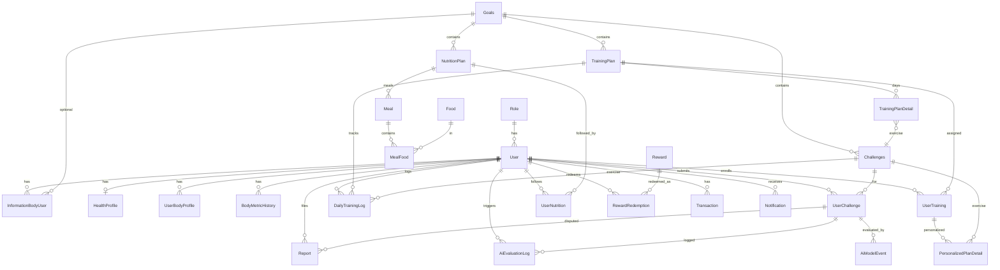

# Báo cáo Entity — Fit Challenge Backend & AI Service

Tài liệu mô tả **các entity** và **schemas** trong toàn bộ hệ thống Fit Challenge.

## Tổng quan

| Hệ thống | Số lượng | Công nghệ |
|----------|----------|-----------|
| **Java Backend (JPA)** | **26** entities | Hibernate/JPA + MySQL |
| **Python AI Service** | **30+** schemas (Pydantic) | FastAPI + Google Gemini |
| **Tổng cộng** | **56+** models | — |

## 1) Tổng quan theo nhóm nghiệp vụ

| Nhóm | Entity | Bảng DB | Ý nghĩa ngắn gọn |
|------|--------|---------|------------------|
| **Danh tính & phân quyền** | `Role` | `Role_user` | Vai trò người dùng |
| | `User` | `User` | Tài khoản: email, mật khẩu, điểm, avatar, liên kết role |
| **Mục tiêu & thử thách** | `Goals` | `Goals` | Mục tiêu tập luyện (catalog) |
| | `Challenges` | `Challenges` | Thử thách thuộc một goal (độ khó, video, loại bài AI, **min_reps / max_reps** ngưỡng pass cho AI) |
| | `UserChallenge` | `user_challenges` | User tham gia challenge: video, điểm, payload AI |
| **Kế hoạch tập** | `TrainingPlan` | `training_plans` | Kế hoạch theo tuần, thuộc một goal |
| | `TrainingPlanDetail` | `training_plan_details` | Từng ngày trong plan: gắn challenge, sets/reps… |
| | `UserTraining` | `user_training` | User đang theo plan nào, tiến độ ngày |
| | `PersonalizedPlanDetail` | `personalized_plan_detail` | Bài tập đã cá nhân hóa (theo user + day + challenge) |
| | `DailyTrainingLog` | `daily_training_logs` | Nhật ký tập theo ngày: trạng thái, calo, score AI… |
| **Hồ sơ sức khỏe / cơ thể** | `HealthProfile` | `health_profile` | Hồ sơ sức khỏe chi tiết (1–1 với user) |
| | `UserBodyProfile` | `user_body_profile` | Chỉ số cơ thể phục vụ cá nhân hóa bài tập |
| | `BodyMetricHistory` | `body_metric_history` | Lịch sử cân nặng, BMI, body fat… |
| | `InformationBodyUser` | `information_body_user` | Thông tin cơ thể + optional link tới goal |
| **Dinh dưỡng** | `NutritionPlan` | `nutrition_plans` | Kế hoạch ăn theo goal |
| | `Meal` | `meals` | Bữa ăn trong plan |
| | `Food` | `foods` | Thực phẩm (macro trên 100g) |
| | `MealFood` | `meal_foods` | Nhiều–nhiều Meal ↔ Food (khối lượng g) |
| | `UserNutrition` | `user_nutrition` | User đang theo nutrition plan nào |
| **Điểm thưởng & giao dịch** | `Reward` | `rewards` | Phần thưởng đổi bằng điểm |
| | `RewardRedemption` | `reward_redemptions` | Lịch sử đổi quà |
| | `Transaction` | `transactions` | Giao dịch điểm/tiền (type, points, amount) |
| **AI & hỗ trợ** | `AiEvaluationLog` | `ai_evaluation_logs` | Log pipeline đánh giá AI (input/output JSON, score) |
| | `AiModelEvent` | `ai_model_events` | Kết quả model gắn `UserChallenge`; cột **reps**, **quality_score**, **confidence**, **passed** + FK **user_id** để query nhanh (index `user_id, created_at`); `result_json` giữ blob đầy đủ |
| | `Report` | `reports` | Khiếu nại / báo cáo sai sót AI hoặc hệ thống |
| | `Notification` | `notifications` | Thông báo in-app cho user |

## 2) Khóa chính & quan hệ chính

### 2.1 Identity

- **`Role`** — PK `Role_id` → **`User`** nhiều–một `Role` (`Role_id`).
- **`User`** — PK `User_Id`; quan hệ một–nhiều tới `InformationBodyUser` (`mappedBy = "user"`).

### 2.2 Goals → Challenges → Training

- **`Goals`** — PK `goal_id`.
- **`Challenges`** — PK `challenge_id`, FK `goal_id` → `Goals`.
- **`TrainingPlan`** — PK `tp_id`, FK `goal_id` → `Goals`.
- **`TrainingPlanDetail`** — PK `tpd_id`, FK `tp_id` → `TrainingPlan`, FK `challenge_id` → `Challenges`.

### 2.3 User participation

- **`UserTraining`** — PK `ut_id`, FK `user_id` → `User`, FK `tp_id` → `TrainingPlan`.
- **`PersonalizedPlanDetail`** — PK `ppd_id`; FK `user_id` → `User`, `challenge_id` → `Challenges`; cột `tpd_id`, `ut_id` lưu tham chiếu số (template / user training) — **không** dùng `@ManyToOne` cho hai cột này.
- **`DailyTrainingLog`** — PK `dtl_id`; FK `user_id`, `tp_id`, `challenge_id`.
- **`UserChallenge`** — PK `uc_id`; FK `user_id`, `challenge_id`.

### 2.4 Nutrition

- **`NutritionPlan`** — PK `plan_id`, FK `goal_id` → `Goals`; `OneToMany` → `Meal`.
- **`Meal`** — PK `meal_id`, FK `plan_id` → `NutritionPlan`; `OneToMany` → `MealFood`.
- **`Food`** — PK `food_id`; `OneToMany` → `MealFood`.
- **`MealFood`** — PK `mfId`, FK `meal_id`, `food_id`.
- **`UserNutrition`** — PK `un_id`, FK `user_id`, `plan_id`.

### 2.5 Health / body metrics

- **`HealthProfile`** — PK `id`, **`@OneToOne`** `user_id` → `User` (unique).
- **`UserBodyProfile`** — PK `id`, FK `user_id` → `User`.
- **`BodyMetricHistory`** — PK `bmh_id`, FK `user_id` → `User`.
- **`InformationBodyUser`** — PK `info_id`, FK `user_id` → `User`, optional FK `goal_id` → `Goals`.

### 2.6 Rewards & transactions

- **`Reward`** — PK `reward_id` (catalog, không FK tới User).
- **`RewardRedemption`** — PK `rr_id`, FK `user_id`, `reward_id`.
- **`Transaction`** — PK `tx_id`, FK `user_id`.

### 2.7 AI, báo cáo, thông báo

- **`AiEvaluationLog`** — PK `ael_id`; FK `user_id`, `challenge_id`, optional `user_challenge_id` → `UserChallenge`.
- **`AiModelEvent`** — PK `event_id`; FK `uc_id` → `UserChallenge`, FK `user_id` → `User`, optional `challenge_id` → `Challenges`; thêm cột `reps`, `quality_score`, `confidence`, `passed`, `exercise_type`, `model_*`, `result_json`.
- **`Report`** — PK `report_id`; FK `user_id`, optional `challenge_id`, `user_challenge_id`, `ai_evaluation_log_id`, optional `assigned_to_user_id` → `User`.
- **`Notification`** — PK `notification_id`, FK `user_id`.

## 3) Sơ đồ quan hệ (mức khái niệm)



## 4) Ghi chú kỹ thuật

- **Đặt tên bảng**: một số bảng dùng chữ hoa/thường lẫn lộn (`User`, `Goals`, `Challenges`) — cần giữ đúng khi viết SQL thủ công hoặc migration.
- **`PersonalizedPlanDetail`**: `tpd_id` và `ut_id` là cột số để map UI/template; không phải quan hệ JPA đầy đủ tới `TrainingPlanDetail` / `UserTraining`.
- **`Challenges.min_reps` / `max_reps`**: backend tính `AiModelEvent.passed` khi lưu kết quả AI (so sánh rep đếm được với ngưỡng). AI service có thể đọc qua API challenge để biết pass range.
- **Tổng rep theo ngày**: dùng `AiModelEventRepository.sumRepsByUserAndCreatedAtBetween` (hoặc SQL `SUM(reps)` trên `ai_model_events` theo `user_id` + khoảng `created_at`).
- **Hai nguồn “body profile”**: `HealthProfile` (chi tiết + tính BMR/TDEE…) và `UserBodyProfile` / `InformationBodyUser` / `BodyMetricHistory` — có overlap có chủ đích (lịch sử vs snapshot).

## 5) AI Service — Python Schemas (Pydantic)

Package `ai-service/app/schemas/` — định nghĩa data models cho FastAPI, đồng bộ với Java entities qua API.

### 5.1 Nutrition Schemas (`nutrition.py`)

| Schema | Mô tả | Tương đồng Java |
|--------|-------|-----------------|
| `UserProfile` | Profile người dùng: weight, height, age, gender, body_fat, activity_level, goal, budget, fitness_level, dietary_restrictions | `User` + `UserBodyProfile` |
| `NutritionPlanRequest` | Request tạo meal plan: user_profile + days | — |
| `NutritionPlanResponse` | Response meal plan: plan_id, daily_plans, weekly_totals, recommendations | `NutritionPlan` |
| `DailyPlan` | Plan cho 1 ngày: meals, totals, shopping_list, cost | `Meal` + `MealFood` |
| `Meal` | 1 bữa ăn: meal_type + list items | `Meal` |
| `MealItem` | 1 món trong bữa: name, amount, calories, protein, carb, fat, cost | `Food` + `MealFood` |
| `FoodRecognitionResult` | Kết quả nhận diện ảnh: food_name, confidence, nutrition, alternatives | — |
| `FoodTrackingRequest/Response` | Request/response cho food tracking | — |
| `AdjustmentRequest/Response` | Request/response điều chỉnh plan | — |
| `CheatMealRequest/Response` | Request/response xử lý cheat meal | — |

### 5.2 Workout Schemas (`workout.py`)

| Schema | Mô tả | Tương đồng Java |
|--------|-------|-----------------|
| `WorkoutRequest` | Request tạo workout plan: user_profile, days, fitness_level | — |
| `WorkoutSession` | 1 buổi tập: day, focus, warmup, exercises, cooldown, is_rest_day, estimated_duration | `TrainingPlanDetail` |
| `Exercise` | 1 bài tập: name, sets, reps, rest_seconds, muscle_groups | `Challenges` |
| `ExerciseType` | Enum: compound, isolation, cardio, flexibility | — |
| `SessionType` | Enum: push, pull, legs, cardio, rest, full_body | — |
| `MuscleGroup` | Enum: chest, back, shoulders, biceps, triceps, legs, core, cardio | — |
| `WarmUpItem` | Bài khởi động: name, duration, description | — |
| `CoolDownItem` | Bài giãn cơ: name, duration, description | — |

### 5.3 Integrated Plan Schemas (`full_plan.py`)

| Schema | Mô tả | Tương đồng Java |
|--------|-------|-----------------|
| `IntegratedDailyPlan` | Kết hợp meal + workout cho 1 ngày: day, meal_plan, workout, notes | — |
| `FullPlanRequest` | Request tạo full plan: user_profile, days, preferences | — |
| `FullPlanResponse` | Response full plan: plan_id, version, created_at, daily_plans, weekly_summary, recommendations, validation_report, parent_plan_id, change_summary | `NutritionPlan` + `TrainingPlan` |

### 5.4 Enum Mappings

| Python Enum | Java Entity | Giá trị |
|-------------|-------------|---------|
| `GoalType` | `Goals` | weight_loss, muscle_gain, maintenance, endurance |
| `ActivityLevel` | — | sedentary, light, moderate, active, very_active |
| `FitnessLevel` | — | beginner, intermediate, advanced |
| `MealType` | `Meal.meal_type` | breakfast, lunch, dinner, snack |
| `BudgetTier` | — | low, medium, high |

### 5.5 Core Components (Business Logic)

Package `ai-service/app/core/`:

| Component | Mục đích |
|-----------|----------|
| `BodyAnalyzer` | Tính BMR, TDEE, macros, phân loại budget tier |
| `PlanValidator` | Validate plan: calories ±10%, protein target, budget limit, auto-retry logic |
| `PreferenceStore` | Lưu user preferences: disliked foods, skipped exercises, plan ratings, feedback |
| `ProgressionTracker` | Track workout progression: current_week, exercise_history, weight_history, auto-adjust sets/reps |
| `QualityScorer` | Score plan quality: diversity, protein adequacy, recovery check |
| `PriceDatabase` | Real Vietnam ingredient prices (50+ items), cost estimation |
| `PlanVersioning` | Plan history tracking, version comparison, revert |

### 5.6 AI Components

Package `ai-service/app/ai/`:

| Component | Model | Chức năng |
|-----------|-------|-----------|
| `AIPlanner` | gemini-3.1-flash-lite | Tạo meal plan (Model 2), goal-specific prompts |
| `AIVision` | gemini-3.1-pro-preview | Nhận diện thức ăn từ ảnh (Model 3) |
| `IntegratedPlanner` | gemini-3.1-flash-lite | Tích hợp meal + workout, sync macros theo calories burned |

---

## 6) Vị trí mã nguồn

### Java Backend (BE)
- **Entity**: `Fit_Ai_Challenge_Web-App_BE/src/main/java/com/example/fitchallenge/Entity/`
- **Repository**: `Fit_Ai_Challenge_Web-App_BE/src/main/java/com/example/fitchallenge/Repository/`
- **Service**: `Fit_Ai_Challenge_Web-App_BE/src/main/java/com/example/fitchallenge/Service/`

### Python AI Service
- **Schemas**: `ai-service/app/schemas/`
- **Core Logic**: `ai-service/app/core/`
- **AI Models**: `ai-service/app/ai/`
- **Entry Point**: `ai-service/main.py`

### Data Flow
```
Java Backend (User data) 
    ↓ API
Python AI Service (Generate plan)
    ↓ API
Java Backend (Save plan to DB)
```
